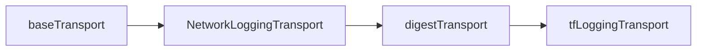

# Enhanced Network Logging for MongoDB Atlas Terraform Provider

## Overview

The MongoDB Atlas Terraform provider now includes enhanced network logging capabilities to provide better visibility into HTTP requests and responses when communicating with the MongoDB Atlas API. This feature helps diagnose API connectivity issues, timeouts, and status code errors.

## Features

### 1. Detailed Request/Response Timing
- Logs the start time of each HTTP request
- Measures and reports the total duration of each request

### 2. Comprehensive Error Context
The logging transport analyzes network errors and provides specific context for common issues:

- **Timeout errors**: Indicates potential API server overload or network connectivity issues
- **Connection refused**: Suggests API server may be down or unreachable
- **DNS resolution failures**: Points to DNS configuration or network connectivity problems
- **TLS certificate errors**: Highlights certificate validity or trust chain issues
- **Request deadline exceeded**: Shows when requests exceed configured timeouts
- **Connection reset**: Indicates unexpected server connection closures

### 3. HTTP Status Code Analysis
- Categorizes responses as Success (2xx), Redirection (3xx), Client Error (4xx), or Server Error (5xx)
- Logs additional details for non-2xx responses
- Includes relevant response headers for debugging
- **Special handling for 401 Unauthorized**: Recognizes digest authentication challenges and logs them as expected behavior rather than errors

### 4. Response Header Logging
For error responses, the transport logs important debugging headers:

## Log Examples

### Successful Request With Authentication Challenge
```
[DEBUG] Network Request Start: GET https://cloud.mongodb.com/api/atlas/v2/groups/123/clusters (started at 2025-01-15T10:30:00.123Z)
[DEBUG] Network Request Complete: GET https://cloud.mongodb.com/api/atlas/v2/groups/123/clusters - Status: 401 (Client Error) - Duration: 120ms
[DEBUG] Digest Authentication Challenge: GET https://cloud.mongodb.com/api/atlas/v2/groups/123/clusters - Status: 401 - Expected first request in digest authentication flow
[DEBUG] Network Request Start: GET https://cloud.mongodb.com/api/atlas/v2/groups/123/clusters (started at 2025-01-15T10:30:00.245Z)
[DEBUG] Network Request Complete: GET https://cloud.mongodb.com/api/atlas/v2/groups/123/clusters - Status: 200 (Success) - Duration: 180ms
```

### HTTP Error Response
```
# authentication challenge omitted
[DEBUG] Atlas Network Request Start: POST https://cloud.mongodb.com/api/atlas/v2/groups/123/clusters (started at 2025-01-15T10:30:00.123Z)
[DEBUG] Atlas Network Request Complete: POST https://cloud.mongodb.com/api/atlas/v2/groups/123/clusters - Status: 400 (Client Error) - Duration: 180ms
[WARN] Atlas HTTP Error Response: POST https://cloud.mongodb.com/api/atlas/v2/groups/123/clusters - Status: 400 Bad Request - Duration: 180ms - Content-Type: application/json
```

### Network Error
```
# authentication challenge omitted
[DEBUG] Atlas Network Request Start: GET https://cloud.mongodb.com/api/atlas/v2/groups/123/clusters (started at 2025-01-15T10:30:00.123Z)
[ERROR] Atlas Network Request Failed: GET https://cloud.mongodb.com/api/atlas/v2/groups/123/clusters - Duration: 30s - Error: context deadline exceeded
[ERROR] Atlas Request Deadline Exceeded: GET https://cloud.mongodb.com/api/atlas/v2/groups/123/clusters - Duration: 30s - Request took longer than configured timeout
```

### Connection Refused Error
```
# authentication challenge omitted
[DEBUG] Atlas Network Request Start: POST https://cloud.mongodb.com/api/atlas/v2/groups/123/clusters (started at 2025-01-15T10:30:00.123Z)
[ERROR] Atlas Network Request Failed: POST https://cloud.mongodb.com/api/atlas/v2/groups/123/clusters - Duration: 5s - Error: dial tcp 192.168.1.1:443: connect: connection refused
[ERROR] Atlas Connection Refused: POST https://cloud.mongodb.com/api/atlas/v2/groups/123/clusters - Duration: 5s - API server may be down or unreachable
```

### DNS Resolution Error
```
# authentication challenge omitted
[DEBUG] Atlas Network Request Start: GET https://cloud.mongodb.com/api/atlas/v2/groups/123/clusters (started at 2025-01-15T10:30:00.123Z)
[ERROR] Atlas Network Request Failed: GET https://cloud.mongodb.com/api/atlas/v2/groups/123/clusters - Duration: 2s - Error: dial tcp: lookup cloud.mongodb.com: no such host
[ERROR] Atlas DNS Resolution Failed: GET https://cloud.mongodb.com/api/atlas/v2/groups/123/clusters - Duration: 2s - Check DNS configuration and network connectivity
```

## Implementation Details

### Transport Chain
The enhanced logging is implemented as a custom HTTP transport that wraps the existing transport chain:



This ensures:
1. **Network-level logging happens before digest authentication** - captures the initial 401 digest challenge requests
2. **All HTTP operations are captured** - including the authentication flow
3. **Terraform logging happens after digest authentication** - prevents logging of sensitive authentication details
4. **Existing functionality is preserved** - maintains compatibility with all existing features
5. **Consistent logging across all MongoDB Atlas API clients** - same transport chain for all SDK versions

### Configuration
The enhanced logging is automatically enabled for all MongoDB Atlas API clients:
- **MongoDB Atlas API**: Uses "Atlas" as the service name in logs
- **MongoDB Realm API**: Uses "Realm" as the service name in logs

No additional configuration is required - the enhanced logging works automatically when debug logging is enabled.

## Troubleshooting Common Issues

### Digest Authentication Flow
MongoDB Atlas uses digest authentication, which requires a two-step process:
1. **Initial request (401 response)**: The first request to any endpoint will return a 401 status with a digest challenge
2. **Authenticated request**: The client automatically retries with proper digest credentials

When you see a 401 status in the logs with the message "Expected first request in digest authentication flow", this is normal behavior and not an error. The digest authentication library will automatically handle the challenge and retry the request with proper credentials.

### Timeout Errors
For "Request Deadline Exceeded" errors:
- Check if the configured timeout is appropriate for your use case
- Verify network stability
- Consider if Atlas API is experiencing high load

### Connection Issues
For "Connection Refused" or "DNS Resolution Failed" errors:
- Verify network connectivity
- Check DNS configuration
- Ensure firewall rules allow HTTPS traffic to MongoDB Atlas
