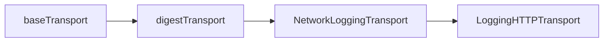

# Enhanced Network Logging for MongoDB Atlas Terraform Provider

## Overview

The MongoDB Atlas Terraform provider now includes enhanced network logging capabilities to provide better visibility into HTTP requests and responses when communicating with the MongoDB Atlas API. This feature helps diagnose API connectivity issues, timeouts, and status code errors.

## Features

### 1. Detailed Request/Response Timing
- Logs the start time of each HTTP request
- Measures and reports the total duration of each request

### 2. Comprehensive Error Context
The logging transport analyzes network errors and provides specific context for common issues:

- **Timeout errors**: Indicates potential API server overload or network connectivity issues
- **Connection refused**: Suggests API server may be down or unreachable
- **DNS resolution failures**: Points to DNS configuration or network connectivity problems
- **TLS certificate errors**: Highlights certificate validity or trust chain issues
- **Request deadline exceeded**: Shows when requests exceed configured timeouts
- **Connection reset**: Indicates unexpected server connection closures

### 3. HTTP Status Code Analysis
- Categorizes responses as Success (2xx), Redirection (3xx), Client Error (4xx), or Server Error (5xx)
- Logs additional details for non-2xx responses
- Includes relevant response headers for debugging

## Log Examples

### Successful Request
```
[DEBUG] Atlas Network Request Start: GET https://cloud.mongodb.com/api/atlas/v2/groups/123/clusters (started at 2025-01-15T10:30:00.123Z)
[DEBUG] Atlas Network Request Complete: GET https://cloud.mongodb.com/api/atlas/v2/groups/123/clusters - Status: 200 (Success) - Duration: 245ms
```

### HTTP Error Response
```
[DEBUG] Atlas Network Request Start: POST https://cloud.mongodb.com/api/atlas/v2/groups/123/clusters (started at 2025-01-15T10:30:00.123Z)
[DEBUG] Atlas Network Request Complete: POST https://cloud.mongodb.com/api/atlas/v2/groups/123/clusters - Status: 400 (Client Error) - Duration: 180ms
[WARN] Atlas HTTP Error Response: POST https://cloud.mongodb.com/api/atlas/v2/groups/123/clusters - Status: 400 Bad Request - Duration: 180ms - Content-Type: application/json
[DEBUG] Atlas Response Header: POST https://cloud.mongodb.com/api/atlas/v2/groups/123/clusters - X-Request-Id: 507f1f77bcf86cd799439011
```

### Network Error
```
[DEBUG] Atlas Network Request Start: GET https://cloud.mongodb.com/api/atlas/v2/groups/123/clusters (started at 2025-01-15T10:30:00.123Z)
[ERROR] Atlas Network Request Failed: GET https://cloud.mongodb.com/api/atlas/v2/groups/123/clusters - Duration: 30s - Error: context deadline exceeded
[ERROR] Atlas Request Deadline Exceeded: GET https://cloud.mongodb.com/api/atlas/v2/groups/123/clusters - Duration: 30s - Request took longer than configured timeout
```

## Implementation Details

### Transport Chain
The enhanced logging is implemented as a custom HTTP transport that wraps the existing transport chain:



This ensures:
1. Network-level logging happens before Terraform's built-in logging
2. All HTTP operations are captured, including authentication
3. Existing functionality is preserved
4. The logging is consistent across all MongoDB Atlas API clients

### Configuration
The enhanced logging is automatically enabled for all MongoDB Atlas API clients:
- **MongoDB Atlas API**: Uses "Atlas" as the service name in logs
- **MongoDB Realm API**: Uses "Realm" as the service name in logs

No additional configuration is required - the enhanced logging works automatically when debug logging is enabled.

### Technical Implementation
The implementation uses the modern `logging.NewLoggingHTTPTransport` function from terraform-plugin-sdk v2, which provides:
- Structured HTTP request/response logging
- Integration with Terraform's logging subsystem
- Proper context propagation for log filtering

## Troubleshooting Common Issues

### High Latency
If you see frequent "Long Network Request" warnings:
- Check network connectivity to MongoDB Atlas
- Verify there are no proxy or firewall issues
- Consider if the Atlas API region is geographically distant

### Timeout Errors
For "Request Deadline Exceeded" errors:
- Check if the configured timeout is appropriate for your use case
- Verify network stability
- Consider if Atlas API is experiencing high load

### Connection Issues
For "Connection Refused" or "DNS Resolution Failed" errors:
- Verify network connectivity
- Check DNS configuration
- Ensure firewall rules allow HTTPS traffic to MongoDB Atlas

### Rate Limiting
For 429 status codes, check the response headers:
- `X-RateLimit-Remaining`: Shows remaining requests in the current window
- `X-RateLimit-Reset`: Shows when the rate limit resets
- `Retry-After`: Provides guidance on when to retry

## Benefits

1. **Faster Issue Resolution**: Detailed error context helps quickly identify the root cause of connectivity issues
2. **Performance Monitoring**: Request timing helps identify performance bottlenecks
3. **Proactive Monitoring**: Warnings for slow requests help identify potential issues before they become critical
4. **Better Debugging**: Comprehensive logging provides all necessary information for troubleshooting API issues
5. **Operational Visibility**: Clear insight into the health and performance of MongoDB Atlas API communications
6. **Modern Implementation**: Uses current terraform-plugin-sdk v2 logging functions for better integration and future compatibility 
