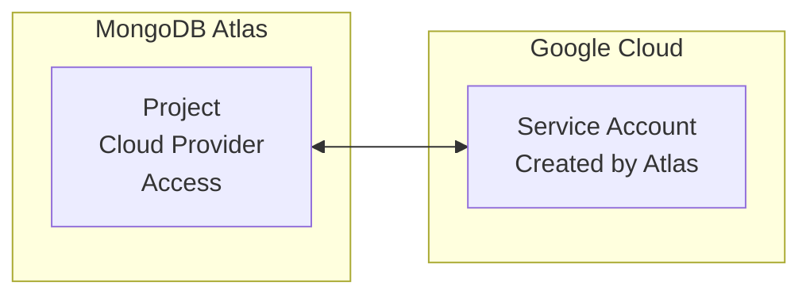

# MongoDB Atlas Cloud Provider Access with Google Cloud Platform (GCP)

This example demonstrates how to set up MongoDB Atlas Cloud Provider Access with Google Cloud Platform (GCP). This creates the necessary setup and authorization for MongoDB Atlas to access GCP resources on behalf of your project.

## What This Example Does

The following Terraform configurations:

1. **Creates Cloud Provider Access Setup**: Establishes the initial setup for MongoDB Atlas to access GCP resources
2. **Authorizes the Access Role**: Completes the authorization process, creating a GCP service account that MongoDB Atlas can use

## Architecture Overview



## Prerequisites

Before running this example, you need:

1. **MongoDB Atlas Account**: With API keys that have project owner permissions
2. **Google Cloud Platform Account**: With a project (no specific GCP permissions required for this setup)
3. **Terraform**: Version 0.13 or later

## Procedure

### 1. Set Up Variables

Create a `terraform.tfvars` file:

```hcl
atlas_public_key  = "<ATLAS_PUBLIC_KEY>"
atlas_private_key = "<ATLAS_PRIVATE_KEY>"
atlas_project_id  = "<ATLAS_PROJECT_ID>"
```

### 2. Deploy the Infrastructure

```bash
terraform init
terraform plan
terraform apply
```

### 3. Verify the Setup

After having successfully deployed your infrastructure, you should get the following outputs:
- Atlas role ID
- GCP service account email created by Atlas

## Important Notes

### GCP-Specific Behavior

Unlike AWS and Azure, GCP Cloud Provider Access:
- **No Configuration Updates**: GCP authorization only requires a role ID and has no additional configuration parameters
- **Immutable After Creation**: Once authorized, you cannot "update" a GCP cloud provider access role
- **New Authorization = New Resource**: If you need to change GCP settings, create a new `mongodbatlas_cloud_provider_access_setup` and `mongodbatlas_cloud_provider_access_authorization` resource and then delete the old one

### Next Steps

After setting up cloud provider access, you can use the created service account for various integrations such as Encryption at Rest using Google Cloud KMS. See the full example [here](https://github.com/mongodb/terraform-provider-mongodbatlas/tree/master/examples/mongodbatlas_encryption_at_rest/gcp)

## Variables

| Variable | Description | Type | Required |
|----------|-------------|------|----------|
| `atlas_public_key` | MongoDB Atlas public API key | string | Yes |
| `atlas_private_key` | MongoDB Atlas private API key | string | Yes |
| `atlas_project_id` | MongoDB Atlas project ID | string | Yes |

## Outputs

| Output | Description |
|--------|-------------|
| `atlas_role_id` | The MongoDB Atlas cloud provider access role ID |
| `gcp_service_account_email` | GCP service account email created by Atlas |

## Related Documentation

- [MongoDB Atlas Cloud Provider Access](https://www.mongodb.com/docs/atlas/security/customer-key-management/)
- [Terraform MongoDB Atlas Provider](https://registry.terraform.io/providers/mongodb/mongodbatlas/latest/docs)
- [mongodbatlas_cloud_provider_access_setup](https://registry.terraform.io/providers/mongodb/mongodbatlas/latest/docs/resources/cloud_provider_access_setup)
- [mongodbatlas_cloud_provider_access_authorization](https://registry.terraform.io/providers/mongodb/mongodbatlas/latest/docs/resources/cloud_provider_access_authorization)
