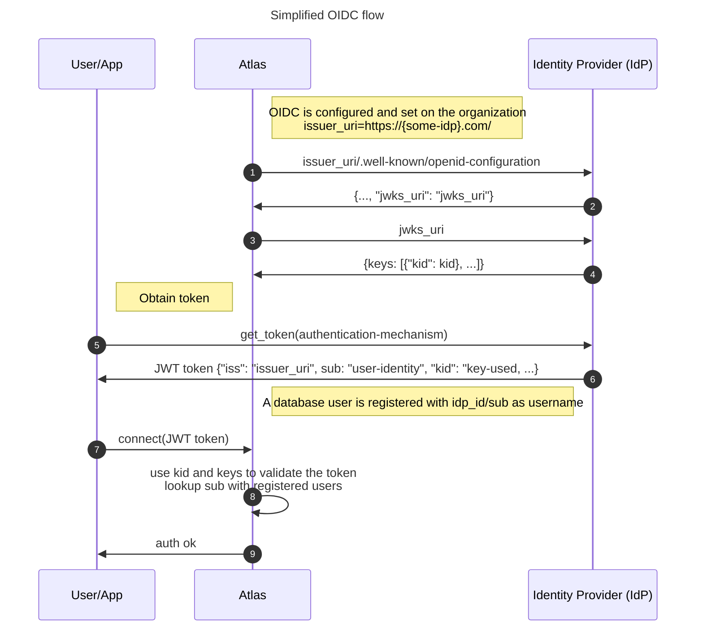
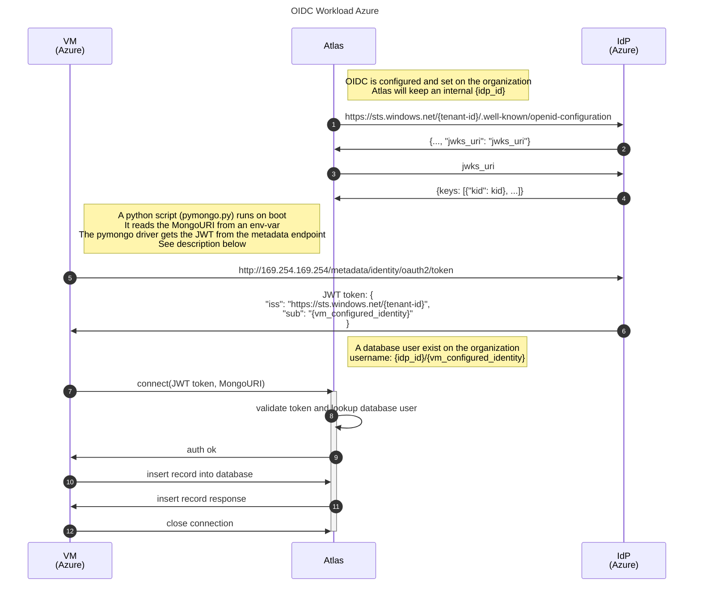

# MongoDB Atlas Provider -- OIDC Workload Azure

## Dependencies

- Terraform [MongoDB Atlas Provider v1.17.0](https://registry.terraform.io/providers/mongodb/mongodbatlas/latest/docs)
- Terraform [Hashicorp Cloud Init Provider v2.3.4](https://registry.terraform.io/providers/hashicorp/cloudinit/latest/docs)
- Terraform [Hashicorp Azurerm Provider v3.106.1](https://registry.terraform.io/providers/hashicorp/azurerm/latest/docs)
- Terraform [Hashicorp Random Provider v3.6.2](https://registry.terraform.io/providers/hashicorp/random/latest/docs)
- A MongoDB Atlas account with an organization configured with [Federated Authentication](https://www.mongodb.com/docs/atlas/security/federated-authentication/#federation-management-console)
  - Get the `federated_settings_id` from the url, e.g., <https://cloud.mongodb.com/v2#/federation/{federated_settings_id}/overview>

## Diagrams

### Simplified OIDC flow




- Example of `issuer_uri` (1):
  - <https://token.actions.githubusercontent.com/>
  - <https://gitlab.com/>
  - <https://sts.windows.net/{tenant-id}/>
- Example of authentication mechanism (5)
  - username+password
  - two factor authentication
  - certificate
- JWT Token Authentication(8):
  - Can use different fields in the `JWT` to authenticate

### OIDC Workload Azure



- (5) We use terraform to configure a [`user_assigned_identity`](https://registry.terraform.io/providers/hashicorp/azurerm/latest/docs/resources/user_assigned_identity) for the VM and use the [metadata endpoint](https://learn.microsoft.com/en-us/entra/identity/managed-identities-azure-resources/how-to-use-vm-token#get-a-token-using-http) to obtain the token
  - See also [MongoDB pymongo docs.](https://www.mongodb.com/docs/languages/python/pymongo-driver/current/security/enterprise-authentication/#mongodb-oidc)
  - The python script is configured by [cloud init](https://cloudinit.readthedocs.io/en/latest/reference/examples.html#writing-out-arbitrary-files) using `custom_data` on the [VM (`linux_virtual_machine`)](https://registry.terraform.io/providers/hashicorp/azurerm/latest/docs/resources/linux_virtual_machine)
- (10) Can be configured with terraform variables:
  - `insert_record_database`
  - `insert_record_collection`
  - `insert_record_fields`

## Usage

**1\. Ensure your Azure credentials are set up.**

1. Install the Azure CLI by following the steps from the [official Azure documentation](https://docs.microsoft.com/en-us/cli/azure/install-azure-cli).
2. Run the command `az login` and this will open your default browser and perform the authentication.
3. Once authenticated, it will print the user details as below:

```shell
⇒  az login
You have logged in. Now let us find all the subscriptions to which you have access...
The following tenants don't contain accessible subscriptions. Use 'az login --allow-no-subscriptions' to have tenant level access.
XXXXX
[
  {
    "cloudName": "AzureCloud",
    "homeTenantId": "XXXXX",
    "id": "XXXXX",
    "isDefault": true,
    "managedByTenants": [],
    "name": "Pay-As-You-Go",
    "state": "Enabled",
    "tenantId": "XXXXX",
    "user": {
      "name": "person@domain.com",
      "type": "user"
    }
  }
]
```

**2\. Ensure your MongoDB Atlas credentials are set up.**

This can be done using environment variables:

```shell
export MONGODB_ATLAS_PUBLIC_KEY="<ATLAS_PUBLIC_KEY>"
export MONGODB_ATLAS_PRIVATE_KEY="<ATLAS_PRIVATE_KEY>"
```

**3\. TFVARS**

Create a file named `vars.auto.tfvars`

```hcl
project_name             = "tf-example-oidc"
location                 = "eastus" # Azure region
owner                    = "my-user"
org_id                   = "ATLAS_ORG_ID" # e.g 65def6ce0f722a1507105aa5
region                   = "US_EAST_1" # Atlas region
insert_record_database   = "test"
insert_record_collection = "test"
ssh_public_key           = "ssh-rsa AAA...." # see below for how you can configure this
```

Configuring the `ssh_public_key` for the Azure VM:

```shell
cd ~/.ssh
ssh-keygen -t rsa -b 4096 -C "<your_email@example.com>" # to generate a keypair for the VM
export TF_VAR_ssh_public_key=$(cat ~/.ssh/id_rsa.pub) # set the `ssh_public_key` with an env var instead of using the variable
```

**4\. Import the `mongodbatlas_federated_settings_org_config`**

replace `{federated_settings_id}` and `{org_id}` and run:

```shell
terraform init
terraform import mongodbatlas_federated_settings_org_config.this {federated_settings_id}-{org_id}
```

**5\. Review the Terraform plan.**

Execute the below command and ensure you are happy with the plan.

```shell
terraform plan
```

**6\. Execute the Terraform apply.**

Now execute the plan to provision the resources.

```shell
terraform apply
```

**7\. Connect to MongoDB to verify the record has been inserted.**

- Get the connection string by running `terraform output -json | jq -r '.user_test_conn_string.value'`
- Open your preferred tool, e.g., [MongoDB Compass](https://www.mongodb.com/products/tools/compass)
- You should see a new record inserted in `{database}` (default name is `test`), `{collection}` (default name is `test`), e.g.: `{"_id": "6661790007beeb09e3f1b914", "hello": "world", "ts": "2024-06-06T08:53:20.125919"}`
  - `{database}` depends on `insert_record_database` Terraform variable
  - `{collection}` depends on `insert_record_collection` Terraform variable
  - It can be up to 2 minutes after `terraform apply` finishes for the record to be inserted

**8\. Destroy the resources.**

- Once you are finished your testing, ensure you destroy the resources to avoid unnecessary Atlas and Azure charges.
- Note that the organization will be unlinked from the [Federated Authentication](https://www.mongodb.com/docs/atlas/security/federated-authentication/#federation-management-console).
  - Use `terraform state rm  mongodbatlas_federated_settings_org_config.this` to avoid this

```shell
terraform destroy
```

## Next Steps

- Change `pymongo_oidc.sh` to run your own app, start your `systemd` service, etc.
- Integrate with your identity provider of choice, ideas:
  - Github for accessing your Atlas Cluster from a Github Action
  - Gitlab for accessing your Atlas Cluster from a Gitlab Job
- For more information, see [MongoDB Atlas Workload OIDC docs](https://www.mongodb.com/docs/atlas/workload-oidc/#prepare-your-external-identity-provider).

## Troubleshooting

### Debugging the VM Instance

1. Get the ssh command for connecting: `terraform output -json | jq -r '.ssh_connection_string.value'` and connect.
2. Verify the python script exist: `ls -la ~` should show `pymongo_oidc.py`.
3. Check the output log from cloud-init:
   - `sudo cat /var/log/cloud-init.log`
     - expect to find log lines where the script result is logged: `/var/lib/cloud/instance/scripts/part-002` (could have a slightly different name)
     - `sudo cat /var/lib/cloud/instance/scripts/part-002`
   - `sudo cat /var/log/cloud-init-output.log`
     - the log should end with something similar to:

```log
... more log content
Installing collected packages: dnspython, pymongo
Successfully installed dnspython-2.6.1 pymongo-4.7.3
WARNING: Running pip as the 'root' user can result in broken permissions and conflicting behaviour with the system package manager. It is recommended to use a virtual environment instead: https://pip.pypa.io/warnings/venv
creating client with uri=mongodb://looooong-connectionstring.mongodb.net:27017/?ssl=true&authSource=admin&replicaSet=atlas-xgvzij-shard-0&authMechanism=MONGODB-OIDC&authMechanismProperties=ENVIRONMENT:azure,TOKEN_RESOURCE:https%3A%2F%2Fmanagement.azure.com%2F # same as output "user_oidc_conn_string"
inserting into test test, record: {'hello': 'world', 'ts': '2024-06-06T08:53:20.125919'}
insert response: InsertOneResult(ObjectId('6661790007beeb09e3f1b914'), acknowledged=True)
script complete
Cloud-init v. 24.1.3-0ubuntu1~22.04.1 finished at Thu, 06 Jun 2024 08:53:21 +0000. Datasource DataSourceAzure [seed=/dev/sr0].  Up 111.45 seconds
```
